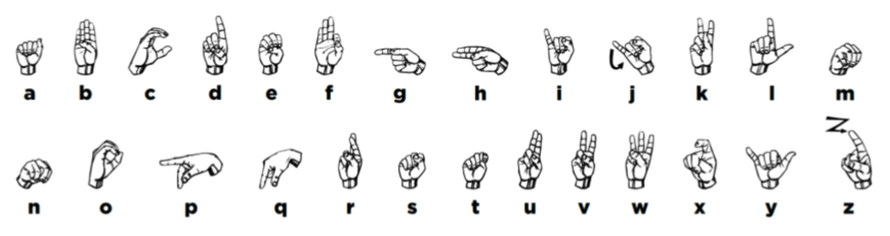
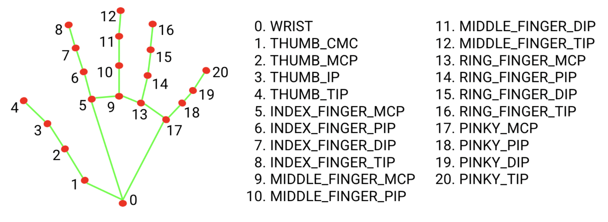
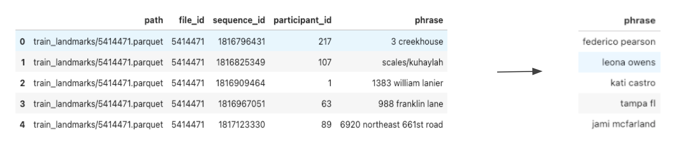
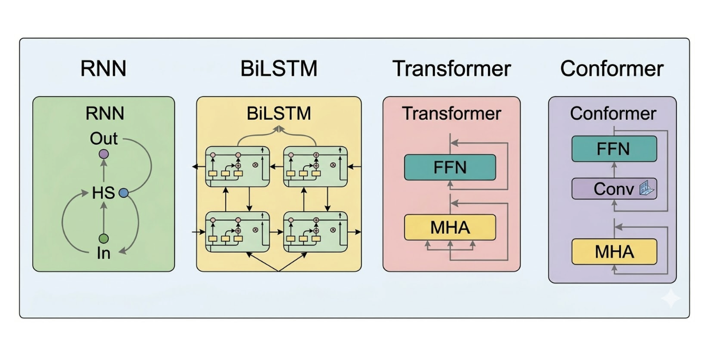
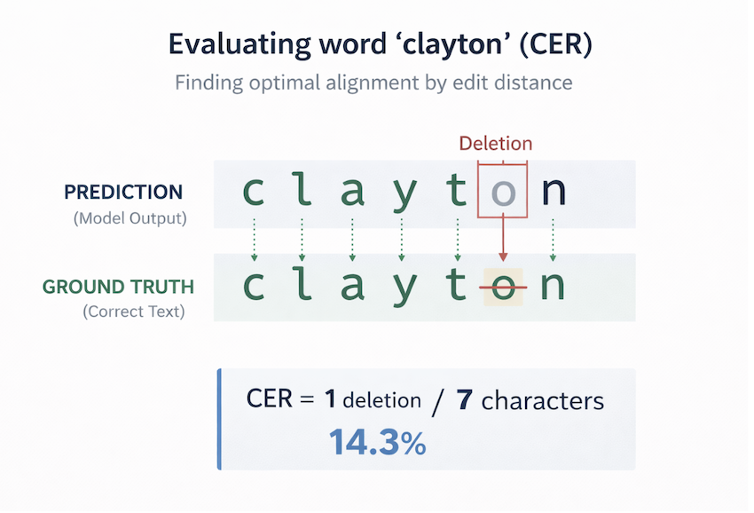
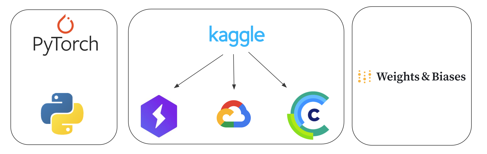
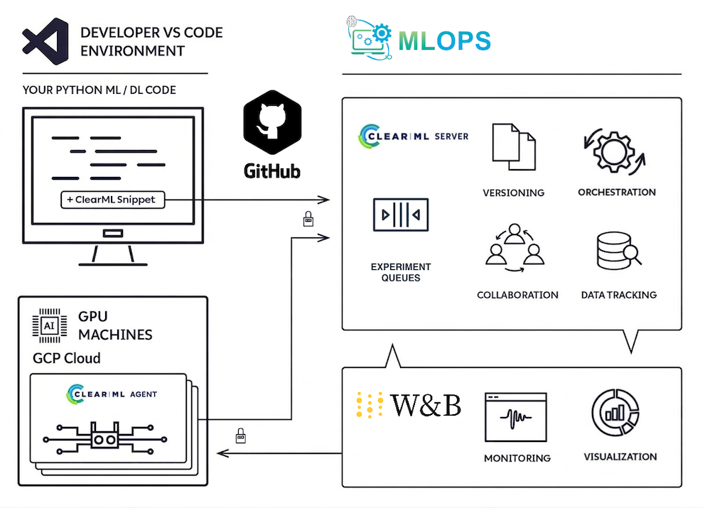

# Sign Language Fingerspelling Recognition


**Team:** 
- Iñaki Rodriguez 
- Julien Benjamin Cojan 
- Pau Vila 
- Santi Scalzadonna

**Advisor:** 
- Laia Tarres Benet

---

## Table of Contents

- [Sign Language Fingerspelling Recognition](#sign-language-fingerspelling-recognition)
  - [Table of Contents](#table-of-contents)
  - [1. Motivation](#1-motivation)
  - [2. Related Work](#2-related-work)
  - [3. Our Proposal](#3-our-proposal)
    - [3.1 Dataset](#31-dataset)
    - [3.2 Problem Formulation](#32-problem-formulation)
    - [3.3 Preprocessing Pipeline](#33-preprocessing-pipeline)
    - [3.4 Neural Architectures](#34-neural-architectures)
    - [3.5 Training Setup](#35-training-setup)
      - [3.5.1 Primary metric](#351-primary-metric)
      - [3.5.2 Secondary metric](#352-secondary-metric)
    - [3.6 Infrastructure](#36-infrastructure)
    - [3.7 MLOps](#37-mlops)
  - [4. Experiments](#4-experiments)
    - [Experiment 1 — Baseline RNN](#experiment-1--baseline-rnn)
    - [Experiment 2 — Architecture Comparison](#experiment-2--architecture-comparison)
    - [Experiment 3 — BiLSTM Hyperparameter Tuning](#experiment-3--bilstm-hyperparameter-tuning)
    - [Test Phase — Best Model Evaluation (BiLSTM v3)](#test-phase--best-model-evaluation-bilstm-v3)
      - [Dataset split](#dataset-split)
      - [Setup](#setup)
    - [Hyperparameter Tuning Experiments](#hyperparameter-tuning-experiments)
  - [5. Next Steps](#5-next-steps)
  - [6. Final Thoughts](#6-final-thoughts)
  - [7. How to Run](#7-how-to-run)
    - [Prerequisites](#prerequisites)
    - [Dataset](#dataset)
    - [Training](#training)
    - [Evaluation](#evaluation)
    - [Real-Time Webcam Inference](#real-time-webcam-inference)
    - [Quick Inference on a Single Sequence](#quick-inference-on-a-single-sequence)
  - [References](#references)

---

## 1. Motivation

Fingerspelling is a fundamental component of American Sign Language (ASL), used to spell out proper names, technical terms, and words that lack a dedicated sign. Despite its importance, automatic fingerspelling recognition remains an open and challenging problem. 



**Unlike static hand gesture classification — which maps a single image to a letter — fingerspelling recognition requires understanding temporal sequences of hand poses that together form words and phrases. The model must learn not just the shape of each letter, but also the transitions between them, which vary naturally across signers, signing speeds, and recording conditions.**

Automatic interpretation of fingerspelling could greatly improve accessibility and inclusion for the deaf and hard-of-hearing community, enabling real-time communication in contexts where human interpreters are unavailable: medical appointments, customer service interactions, emergency situations, and everyday conversations. Existing solutions are either too slow for real-time use, too brittle across signers, or require specialized hardware. This project addresses this gap by building a full fingerspelling recognition pipeline — from raw hand landmarks to text — evaluated across multiple architectures under realistic compute constraints.

---

## 2. Related Work

Several recent papers tackle fingerspelling and sign language recognition using MediaPipe landmarks as input, providing useful context for the design decisions made in this project.

**Linguistically Motivated Sign Language Segmentation** — Moryossef et al., EMNLP 2023
[(link)](https://aclanthology.org/2023.findings-emnlp.846)

This work addresses sign and phrase segmentation using supervised learning from manual annotations. Their base architecture — MediaPipe landmarks fed into an LSTM — is closely aligned with our own baseline approach. They explore several extensions on top of this foundation: 3D pose normalization, optical flow features, face keypoints, and auto-regressive connections between timesteps to encourage consistent output labels. Notably, they report in their conclusions that 3D normalization may actually *hurt* prediction quality, which is a relevant caution for our own normalization step and an area worth revisiting.

**FSBoard** — Georg et al., 2024
[(link)](https://arxiv.org/pdf/2407.15806)

This paper introduces a new fingerspelling dataset and provides one of the most thorough discussions of the inherent difficulty of the task. Key findings relevant to our work:

- Fingerspelling accounts for approximately **12–35% of all ASL signing**, underlining its practical importance.
- The ASL manual alphabet shares many handshapes with French, Italian, and German Sign Languages, suggesting that a strong fingerspelling model could generalize across multiple sign languages.
- Signers average around **65 words per minute**, with some exceeding **100 wpm** — highlighting the challenge of modeling fast, fluid hand motion.
- At speed, signers often **"bounce" or "slide"** a handshape when a letter repeats within a word, producing ambiguous intermediate frames that are hard to label.
- **Co-articulation effects** — where adjacent letters influence each other's hand position — create transitions that don't correspond to any canonical letter shape.
- **Word boundary detection** (determining where one fingerspelled word ends and another begins) is a separate, open challenge.

Their baseline model follows the same paradigm as YouTube-ASL: MediaPipe landmarks + an adapted T5 Transformer.

**YouTube-ASL** — Shi et al., 2023
[(link)](https://arxiv.org/abs/2306.15162)

This work introduces a large-scale ASL dataset collected from YouTube and establishes a strong baseline using a **MediaPipe + modified T5** architecture. Rather than using text token embeddings, each 255-dimensional landmark frame is projected into the T5 encoder via a learned linear projection layer; the rest of the architecture is a standard T5.1.1-Base encoder-decoder Transformer. This is directly relevant to our Transformer experiments: it demonstrates that a Transformer-based architecture *can* work for this task, but requires a large-scale pretraining corpus and an encoder-decoder design — conditions that were outside the scope of our constrained experiments.

**Takeaways for this project:**
- The MediaPipe + recurrent architecture paradigm is well-established as a practical baseline.
- Transformer-based models are the current state of the art but are data- and compute-hungry — consistent with our own observations in Experiment 2.
- The challenges of co-articulation, repeated letters, and word boundary detection explain why even our best model (CER 0.38) still struggles with longer or less common phrases.
- The question of whether 3D normalization helps or hurts (raised by Moryossef et al.) is worth investigating as a future step.

---

## 3. Our Proposal

This project explores how deep learning can help bridge the accessibility gap in fingerspelling recognition. Starting from raw hand landmark data extracted by MediaPipe, we build a system that recognizes fingerspelled phrases as text — and we evaluate several neural architectures in terms of both accuracy and practical trainability under constrained compute budgets.

**Goals:**
- Build a complete pipeline from raw hand landmarks to recognized text.
- Establish a reproducible baseline using a simple RNN.
- Progressively improve performance by exploring more expressive architectures.
- Create a foundation that could scale to other sign languages or be extended with richer features.

### 3.1 Dataset

Multiple ASL datasets exist, covering different signing modalities and input types. Before selecting our dataset, we surveyed the available options:

| Dataset | Sign Type | Input Format |
|---|---|---|
| [ASL Alphabet](https://www.kaggle.com/datasets/grassknoted/asl-alphabet/data) | Fingerspelling (static) | Static image |
| [ASL Letters](https://huggingface.co/datasets/EitanG98/asl_letters) | Fingerspelling (static) | Static image |
| [Sign Language MNIST](https://www.kaggle.com/datasets/datamunge/sign-language-mnist/data) | Fingerspelling (static) | Static image (pixel CSV) |
| [MediaPipe Processed ASL](https://www.kaggle.com/datasets/vignonantoine/mediapipe-processed-asl-dataset) | Fingerspelling (static) | Static landmarks |
| [FSBoard](https://www.kaggle.com/datasets/googleai/fsboard) | Fingerspelling (dynamic) | Video + MediaPipe landmarks |
| [ChicagoFSWild / ChicagoFSWild+](https://home.ttic.edu/~klivescu/ChicagoFSWild.htm) | Fingerspelling (dynamic) | Sequences of image frames |
| [American Sign Language (ASL)](https://www.kaggle.com/datasets/asthalochanmohanta/american-sign-language-asl) | Word spelling | Videos |
| [OpenASL](https://github.com/chevalierNoir/OpenASL) | Word spelling | Videos |
| [WLASL](https://dxli94.github.io/WLASL/) | Word spelling | Videos |

Static datasets (images of individual letters) are not suitable for this task — fingerspelling recognition is inherently a temporal problem, and isolated static frames do not capture the transitions and co-articulation effects that occur at signing speed. Word-spelling datasets involve full signs rather than individual letters, which is a different task. This narrowed our selection to the dynamic fingerspelling datasets:

| Dataset | Size | Participants | Sequences | Labels | Input |
|---|---|---|---|---|---|
| [Google ASL Fingerspelling](https://www.kaggle.com/competitions/asl-fingerspelling/data) | 190 GB | 94 | 67,208 | Sentences & URLs | MediaPipe landmarks |
| [ChicagoFSWild](https://home.ttic.edu/~klivescu/ChicagoFSWild.htm) | 14 GB | 160 | 7,304 | Words / short sentences | JPG frame sequences |
| [ChicagoFSWild+](https://home.ttic.edu/~klivescu/ChicagoFSWild.htm) | 82 GB | 260 | 55,232 | Words / short sentences | JPG frame sequences |
| [FSBoard](https://www.kaggle.com/datasets/googleai/fsboard) | 1.45 TB | 147 | 151,000 | Sentences, addresses, nouns | Video + MediaPipe landmarks |

We selected the **Google ASL Fingerspelling Competition dataset** from Kaggle, which contains sequences of MediaPipe hand landmarks paired with the corresponding text phrases. The dataset covers **94 participants** and, after cleaning, yields approximately **67,000 sequences** of signed phrases at a manageable size (190 GB). FSBoard is larger and richer but at 1.45 TB was not practical under our compute budget. ChicagoFSWild provides raw image frames requiring additional landmark extraction, adding pipeline complexity without a clear quality benefit.

**Dataset details**

Landmark data was extracted from raw video using the **MediaPipe holistic model**. Each Parquet file contains ~1,000 sequences with 1,629 spatial columns covering x, y, z coordinates for 543 landmarks across four types (`face`, `left_hand`, `pose`, `right_hand`). Not all frames have detectable hands — some sequences contain frames where MediaPipe failed to detect the hand entirely.



**We use only the 21 right-hand landmarks.** This gives 63 raw features per frame (x, y, z per landmark). Velocity features (frame-to-frame deltas) are concatenated to the position features, giving **126 input features per frame** (63 position + 63 velocity). Note: while MediaPipe's depth prediction is unreliable, z is retained as an input feature and left to the model to down-weight.

Metadata is provided via `train.csv` and `supplemental_metadata.csv`, each with the following columns:

| Column | Description |
|---|---|
| `path` | Path to the landmark Parquet file |
| `file_id` | Unique identifier for the data file |
| `participant_id` | Unique identifier for the signer |
| `sequence_id` | Unique identifier for the landmark sequence |
| `phrase` | Target text label for the sequence |

The train/val split is done **by participant ID** (80/20) to prevent data leakage — i.e., the same person never appears in both training and validation sets, ensuring the model generalises to unseen signers.

| Split | Phrase content | Sequences |
|---|---|---|
| Train / Validation | Randomly generated addresses, phone numbers, and URLs | 54,496 train · 6,209 val |
| Supplemental | Natural fingerspelled sentences | ~4,413 usable after filtering |

- **Vocabulary:** 27 characters (a–z + space), plus one CTC blank token → 28 output classes.
- **Label mapping:** Defined in `character_to_prediction_index.json`.

The original dataset contains a significant number of phrases with digits, punctuation, URLs, and addresses (e.g., phone numbers, street addresses). These were deliberately excluded from training, reducing the working vocabulary to lowercase letters and spaces only. This was a pragmatic scoping decision: a smaller, cleaner output space makes the sequence alignment problem more tractable, allows earlier validation of the core architecture, and avoids the model spending capacity on rare characters. Expanding the vocabulary to cover the full character set remains an open next step.

### 3.2 Problem Formulation

Before writing any model code, the first step was to understand the structure of the data and commit to a technical approach. This analysis — documented in our [Kaggle notebook series](#references) — shaped every design decision that followed.

**Key observations from the dataset:**
- There are no frame-level annotations. Each sample is labeled at the level of a full phrase, not individual letters.
- The input is not video or raw images, but pre-extracted sequences of numerical vectors (MediaPipe landmarks). Each frame is a high-dimensional vector; the number of frames varies between samples.
- This means the model must learn to align a variable-length sequence of landmark frames with a shorter sequence of characters — without being told which frame corresponds to which letter.

**Approaches considered and discarded:**

| Approach | Reason discarded |
|---|---|
| Frame-level letter segmentation | No reliable dataset exists with this format for ASL fingerspelling |
| Artificial cuts (divide frames equally per letter) | Introduces noise; does not respect signing dynamics or letters with motion (e.g. J, Z) |
| 2D CNNs on raw frames | Not applicable — input is already landmark vectors, not pixels |

**Chosen approach — full phrase + CTC:**

CTC (Connectionist Temporal Classification) is the standard solution for sequence alignment problems where the correspondence between input and output is unknown. It takes a long input sequence (frames) and a short target sequence (characters), and learns the alignment automatically — without requiring frame-level labels. This is the same mechanism used in speech recognition and lip reading, and it fits the fingerspelling problem directly.


The key insight is that using CTC is not an arbitrary choice: it is a direct consequence of how the data is structured. Any approach that requires explicit frame-to-letter alignment would need manual annotation that does not exist in the dataset.

### 3.3 Preprocessing Pipeline

Raw landmark data requires several cleaning and enrichment steps before it can be used for training:

1. **Invalid frame removal:** Frames where all 21 landmarks are NaN (i.e., MediaPipe failed to detect the hand) are dropped entirely. Remaining NaN values in partially detected frames are filled with zero.
2. **Normalization:** Each frame is centered on the wrist landmark (landmark 0) and scaled by the maximum extent across x and y axes. This makes the representation translation- and scale-invariant, so the model is not affected by where the hand appears in the frame or how close the signer is to the camera.
3. **Velocity features:** For each frame, we compute the per-landmark displacement relative to the previous frame (frame-to-frame delta). These velocity features are concatenated to the position features, doubling the input dimensionality: **63 position + 63 velocity = 126 input features**. Velocity captures the dynamic aspect of fingerspelling — how fast the hand is moving — which the position alone does not encode.
4. **Phrase cleaning:** The original dataset contains phrases with digits, punctuation, and URLs (e.g., phone numbers, addresses). These were filtered out to keep the initial vocabulary focused on lowercase letters and spaces only, reducing noise during early training.
5. **Data augmentation (training only):**
   - *Temporal resampling:* Each sequence is randomly resampled to 0.8×–1.2× its original speed, simulating faster and slower signers.
6. **Sequence padding/truncation:** All sequences are padded or truncated to a fixed length of **160 frames** to enable batched training.




### 3.4 Neural Architectures

We evaluated four architectures, progressing from a simple recurrent baseline to more powerful hybrid and attention-based models:

**RNN (Baseline)**
A simple single-direction RNN with a linear input projection layer. Architecture: `Linear(126→128) → RNN(128, 1 layer) → Linear(60) → LogSoftmax`. This model captures basic temporal dependencies and establishes the performance floor. Its simplicity makes it useful for diagnosing data quality issues, gradient instability, and coordinate system problems before committing to more complex models.

**BiLSTM**
A Bidirectional LSTM that reads the sequence in both forward and backward directions, providing each timestep with full context from the entire sequence. This architecture is well-suited for fingerspelling: the bidirectional pass allows the model to use future context when predicting each character, capturing the transitions and co-articulation effects that occur across frames.

**Transformer**
A standard encoder-only Transformer using multi-head self-attention. Self-attention can theoretically model any pairwise dependency between frames, regardless of distance, making it appealing for long fingerspelled phrases. However, Transformers are data-hungry and typically need significantly more training examples and epochs to learn useful representations from scratch.

**Conformer**
A hybrid of convolution and self-attention, originally proposed for speech recognition (ASR). It interleaves local convolutional blocks with global self-attention blocks to capture both fine-grained local patterns and long-range context. Like the Transformer, it tends to require large datasets to show its full potential.



### 3.5 Training Setup

All models were trained with the following common setup:

- **Loss function:** CTC (Connectionist Temporal Classification). CTC is the standard choice for sequence-to-sequence tasks where the alignment between input frames and output characters is unknown. It learns to assign character probabilities across frames without requiring frame-level labels.
- **Decoding:** Greedy CTC decoding at inference time — the most likely character per frame is selected, then consecutive duplicates and blank tokens are collapsed.
- **Optimizer:** Adam with an initial learning rate of 5e-4 (adjusted per experiment).
- **Regularization:** Gradient clipping and early stopping based on validation CER.

#### 3.5.1 Primary metric

- **Character Error Rate**  (CER) = (Insertions + Deletions + Substitutions) / Total characters. Lower is better; a CER of 0 means perfect prediction.



#### 3.5.2 Secondary metric

- **Word Error Rate:**  (WER) = proportion of words where at least one character is wrong. WER is a stricter measure than CER — a single character error makes an entire word incorrect — and gives a better sense of end-to-end usability. Both CER and WER were tracked via W&B across all runs.

### 3.6 Infrastructure

The project was developed iteratively across multiple compute environments, driven by resource availability and the need to scale experiments:

- **Language & framework:** Python with PyTorch.
- **Hand detection:** MediaPipe was used for real-time hand landmark extraction during inference (webcam demo).
- **Training progression:** We started on Kaggle notebooks for initial prototyping. As experiments grew in complexity, we migrated to Lightning AI for better runtime management. Once Lightning compute credits were exhausted, we moved training to Google Cloud GPU instances for higher throughput and larger dataset runs.
- **Experiment tracking:** Weights & Biases (W&B) was used to monitor and compare training runs, tracking metrics such as CER, training loss, and average edit distance across all experiments.



### 3.7 MLOps

Once training moved to Google Cloud, we set up a lightweight MLOps stack to better manage experiment queuing, execution, and artifact storage across the team.

**Google Cloud VM**

Training ran on a single GCP instance (`instance-fingerspelling`) in zone `us-central1-a`, configured as follows:

| Component | Spec |
|---|---|
| Machine type | `g2-standard-12` (12 vCPUs, 48 GB RAM) |
| GPU | 1× NVIDIA L4 (~23 GB VRAM) |
| Operating System | Google, Deep Learning VM with CUDA 12.4, M129, Debian 11, Python 3.10 |
| Boot disk | Debian 11, 250 GB NVMe SSD |
| Provisioning | Standard (not Spot — prevents preemption during long runs) |

The VM was intentionally provisioned as Standard rather than Spot, since Spot instances can be preempted by GCP at any time and cannot be converted to Standard after creation. To switch, a new Standard VM was created reusing the existing boot disk.

**ClearML: Job Queue & Experiment Tracking**

ClearML served as the central orchestration layer, connecting the team's local machines to the GCP VM through a hosted server.

Architecture:
- **Server:** Hosted at [app.clear.ml](https://app.clear.ml) (free tier) — no self-hosting required.
- **Agent:** Runs as a systemd daemon on the VM, picking tasks from the `default` queue and executing them sequentially on the GPU.
- **SDK:** Integrated into `src/train.py` via `Task.init()` — automatically captures all argparse parameters, metrics, stdout logs, and GPU stats per run.



**Auto-Shutdown Watchdog**

To control GPU costs (~$0.98/hour), the VM was configured with a custom auto-shutdown watchdog. A systemd timer runs every 5 minutes and checks two conditions: whether the GPU is active (`nvidia-smi`) and whether any tasks are pending in the ClearML queue. If both are idle for 30 consecutive minutes, the VM shuts itself down automatically. The VM can be restarted on demand via the GCP Console or `gcloud` CLI.

**Checkpoint Sync to GCS**

Model checkpoints were automatically synced to a Google Cloud Storage bucket (`gs://aidl-fingerspelling-checkpoints/models/`) every 30 minutes via a cron job running `sync_checkpoints.py`. Each training run produces four files:

- `{run_name}_{task_id}_best.pt` — best checkpoint by validation CER
- `{run_name}_{task_id}_best.txt` — metadata: epoch, config, ClearML metrics
- `{run_name}_{task_id}_latest.pt` — last epoch checkpoint (for resuming)
- `{run_name}_{task_id}_latest.txt` — metadata for latest checkpoint

The `task_id` suffix (first 8 chars of the ClearML task ID) ensures checkpoints from different runs of the same experiment never overwrite each other and can always be traced back to their ClearML task entry.

---

## 4. Experiments

The experiments were conducted in three stages: establishing a baseline, comparing architectures, and tuning the best architecture.

---

### Experiment 1 — Baseline RNN

**Hypothesis:** A simple unidirectional RNN trained on raw landmark positions is sufficient to learn some structure from the data and provide a meaningful performance baseline. We expect it to underfit due to limited model capacity, but it should confirm that the data pipeline and CTC training setup are working correctly.

**Setup:**
- Architecture: Linear(126→128) → RNN(128, 1 layer) → Linear(60) → LogSoftmax
- Dataset: full cleaned dataset
- Epochs: 20, Batch size: 16, LR: 5e-4, Hidden dim: 128

**Results:**
- Training loss: 2.1
- Validation CER: 0.70

**Conclusions:**
The RNN learns to reduce CER steadily throughout training, confirming that the pipeline is functional and the data contains learnable structure. However, CER 0.70 means the model is still making errors on roughly 7 out of every 10 characters — it can partially recognize common or short sequences but fails on longer or less frequent phrases. The unidirectional nature of the RNN limits its ability to use future context when decoding each frame. This motivated exploring architectures with bidirectional processing and multi-scale feature extraction.

The baseline was developed iteratively across several Kaggle notebooks: initial training with epoch tuning, deliberate overfitting on 100 epochs to confirm the model could learn at all, metric debugging and CER visualization and finally integration of W&B logging and wrist-centered landmark normalization. Each version informed the next and led to the stable training pipeline used in all subsequent experiments.

---

### Experiment 2 — Architecture Comparison

**Hypothesis:** More expressive architectures — particularly those that combine local feature extraction with bidirectional context — will outperform the simple RNN. Transformer-based models may struggle under our data and compute constraints.

**Setup:**
All four architectures (RNN, BiLSTM, Transformer, Conformer) were trained under the same conditions to enable a fair comparison:
- Dataset: Same 3k-sequence subset for initial comparison
- Epochs: 20, Batch size: 16, LR: 5e-4

**Results:**

| Architecture    | Train Loss | Val CER | Notes                              |
|-----------------|------------|---------|------------------------------------|
| RNN             | 2.1        | 0.70    | Stable training, limited capacity  |
| BiLSTM    | **1.6**    | **0.60**| Best performance, stable convergence|
| Conformer       | 3.1        | 0.90    | Early stopping, emits many blanks  |
| Transformer     | 3.2        | 1.00    | Early stopping, fails to converge  |

**Conclusions:**
BiLSTM is the clear winner in this constrained setting. The combination of dilated convolutions for local pattern extraction and bidirectional LSTM for sequence-level context provides the best balance of capacity and data efficiency. The RNN remains a functional baseline. Both the Transformer and Conformer trigger early stopping — they fail to reduce CER meaningfully within 20 epochs on the small subset. This is expected: attention-based models are known to require more data and longer training to stabilize. Their underperformance here is not a reflection of their true capability, but rather of the resource constraints of this study. BiLSTM was selected as the architecture to optimize in Experiment 3.

---

### Experiment 3 — BiLSTM Hyperparameter Tuning

**Hypothesis:** The BiLSTM architecture has not yet reached its performance ceiling. Increasing training data, model capacity, and training duration should yield substantial further improvements in CER.

**Setup:**
Three configurations were compared progressively:

| Parameter     | v1 (Baseline) | v2     | v3 (Best) |
|---------------|--------------|--------|-----------|
| Epochs        | 20           | 40     | **50**    |
| Train size    | 3k           | 50k    | **50k**   |
| Batch size    | 16           | 16     | **32**    |
| Learning rate | 5e-4         | 5e-4   | **1e-3**  |
| Hidden dim    | 128          | 128    | **256**   |

Key changes from v1 to v3:
- Training data increased from 3k to 50k sequences (~16× more).
- Hidden dimension doubled from 128 to 256, increasing model capacity.
- Batch size increased from 16 to 32 for more stable gradient estimates at larger scale.
- Learning rate raised to 1e-3 to accelerate convergence over more epochs.

**Results:**

| Metric              | v1    | v2    | v3 (Best) |
|---------------------|-------|-------|-----------|
| Train Loss          | 1.57  | 1.22  | **0.71**  |
| Val CER             | 0.63  | 0.52  | **0.38**  |
| Avg Edit Distance   | 9.87  | 8.44  | **4.95**  |

**Conclusions:**
The most impactful single change was **scaling the training data from 3k to 50k sequences**. This alone (v2) reduced CER by 0.11 points. Further increasing model capacity and tuning learning rate and batch size (v3) brought CER down to 0.38 — a 40% relative improvement over the initial v1 configuration. The average edit distance dropped from ~10 characters off per prediction to ~5, which starts to approach practically useful quality for shorter phrases. The learning curves show that the model had not converged by epoch 20 in earlier runs, confirming that longer training was warranted.

The model handles short, common phrases well but still struggles with longer or less frequent sequences.

---

### Test Phase — Best Model Evaluation (BiLSTM v3)

To measure real-world generalisation, the best checkpoint (epoch 34, BiLSTM v3) was evaluated on the **supplemental held-out test set** — a separate portion of the Google ASL dataset not seen during training or validation.

#### Dataset split

The supplemental test set is a distinct split of the [Google ASL Fingerspelling Competition dataset](https://www.kaggle.com/competitions/asl-fingerspelling/data) — consisting mostly of natural fingerspelled sentences.

**Format:** Landmark data extracted from raw video using the MediaPipe holistic model. Each Parquet file contains ~1,000 sequences, with 1,629 spatial columns covering x, y, z coordinates for 543 landmarks across four types (`face`, `left_hand`, `pose`, `right_hand`). Not all frames have detectable hands — some sequences contain frames where MediaPipe failed to detect the hand entirely.

**Our usage:** We use only the 21 right-hand landmarks (x, y → 42 features per frame; z discarded as noted by MediaPipe's own documentation on depth prediction reliability). After filtering sequences with no right-hand landmarks, the supplemental set yields **4,413 usable sequences** across 53 Parquet files.

#### Setup

- Checkpoint: `best_ever.pt` (epoch 34, BiLSTM v3)
- Dataset: supplemental landmarks (53 parquet files → 4,413 usable sequences after filtering)
- Evaluation script: `src/evaluate.py` running on the GCP VM

**Results:**

| Metric          | Validation (v3) | Test.           |
|-----------------|-----------------|-----------------|
| CER             | 0.38            | 0.52            |
| Avg Edit Dist   | 4.95            | 14.84           |

**Best predictions by CER:**

| CER  | Ground Truth                    | Prediction                     |
|------|---------------------------------|--------------------------------|
| 0.05 | nobody cares anymore            | nobody caresanymore            |
| 0.09 | round robin scheduling          | roundrobinscheduling           |
| 0.10 | we drive on parkways            | wedriveon parkways             |
| 0.11 | i hate baking pies              | ihate bakingpies               |
| 0.12 | rain rain go away               | rain raingoaway                |
| 0.12 | i watched blazing saddles       | iwatched blazingsadles         |
| 0.12 | wishful thinking is fine        | wishful thinkingisfin          |
| 0.13 | do not worry about this         | donot wory aboutthis           |
| 0.13 | user friendly interface         | userfriendlinterface           |
| 0.14 | a quarter of a century          | aquauter ofa century           |

**Analysis:**

The test CER (0.52) is 14 points higher than the validation CER (0.38), indicating a distribution gap between the training/validation data and the supplemental test set — likely due to different signers, phrase lengths, or signing styles not seen during training.

The most striking pattern in the predictions is **systematic space dropping**: the model correctly recognises most characters but consistently fails to insert spaces between words (e.g., *"nobody cares anymore"* → *"nobody caresanymore"*, *"round robin scheduling"* → *"roundrobinscheduling"*). This directly explains the near-perfect WER of 0.9951 and 0% exact match — even when the character sequence is almost entirely correct, a missing space makes every affected word count as an error. This is consistent with the challenge highlighted by Georg et al. (FSBoard): word boundary detection is an open problem in fingerspelling recognition, and the space character is particularly ambiguous at signing speed.

**The character-level quality of the best predictions (CER 0.05–0.15) suggests the model has learned solid letter-level recognition. The primary remaining failure modes are word boundary detection, occasional letter deletions on longer phrases, and generalisation to unseen signers.**

---

### Hyperparameter Tuning Experiments

Building on Experiment 3 — BiLSTM Hyperparameter Tuning, we conducted a deeper systematic search on the BiLSTM model — iteratively varying learning rate, batch size, hidden dimension, and dropout to minimise validation CER and control overfitting. All runs used the full training dataset, CTC loss, Adam optimiser, and a `ReduceLROnPlateau` scheduler monitoring validation CER, executed on the GCP VM via the ClearML queue.

The table below summarises the most recent runs in this tuning phase:

| Run | Hidden Dim | Batch Size | LR | Dropout | Val CER | Val WER | Train/Val Gap | Notes |
|-----|-----------|------------|-----|---------|---------|---------|---------------|-------|
| clearml-l4-best-config-dropout-03 | 512 | 128 | 1e-3 | 0.3 | 0.394 | 0.903 | 0.219 | Dropout on best config; new best CER at the time |
| clearml-l4-golden-arch-full-data | 256 | 64 | 1e-3 | 0 | 0.511 | 0.998 | ~0.020 | CTC collapse on full data without dropout |
| clearml-l4-best-config-batch-64 | 512 | 64 | 1e-3 | 0.3 | 0.386 | 0.902 | 0.284 | Batch 128→64 improved CER but widened gap |
| clearml-l4-golden-arch-hidden-256 | 256 | 64 | 1e-3 | 0.3 | 0.383 | 0.907 | 0.165 | hidden=256 + dropout=0.3; best gap across all runs |
| clearml-l4-best-config-batch-32 | **256** | **32** | 1e-3 | **0.3** | **0.372** | 0.887 | 0.180 | New best val CER; batch 64→32 on hidden=256 config |

**Key findings:**

- **hidden_dim=256 + dropout=0.3 + batch=32** (`clearml-l4-best-config-batch-32`) achieved the best val CER (0.372) — further reducing batch size on the golden architecture continued to improve generalisation.
- **CTC collapse** occurred when scaling to full data without dropout on the hidden=256 architecture, confirming that dropout is critical at this data scale.
- **Batch size reduction** (128→64→32) consistently improved val CER; pairing with dropout kept the train/val gap from widening.

We iteratively tuned key hyperparameters (LR, batch size, hidden dim, dropout) to minimise character error rate and control overfitting, achieving a best val CER of **0.372** with a train/val gap of **0.180**.

For the complete experiment log — including all runs, full hyperparameter details, LR decay history, and per-experiment notes — see [experiments.md](experiments.md) and [W&B Report](https://api.wandb.ai/links/inaki-rodriguez-reyes-upc-universidad-peruana-de-ciencia/so8y4yyw)

---

## 5. Next Steps

The current system is a working proof of concept. Several directions offer clear paths toward production-quality performance:

**Dataset & Feature Enrichment**
- **Pairwise fingertip distances:** Computing the Euclidean distance between each pair of the 5 fingertips per frame would add 10 new features that explicitly encode the spatial relationship between fingers. This could help the model distinguish between letters that differ only in relative finger position (e.g., 'a' vs 'e').
- **Vocabulary expansion:** The current model only handles lowercase letters and spaces. Expanding to include digits and punctuation would greatly increase practical applicability, at the cost of a larger output space and more training data requirements.
- **Larger datasets:** The Transformer and Conformer architectures were clearly undertrained in our experiments. Training them on a significantly larger corpus (e.g., combining multiple ASL datasets) could unlock their potential and surpass the BiLSTM.

**Architecture Improvements**
- **Beam search + language model:** The test results show that space dropping is the dominant failure mode. Replacing greedy CTC decoding with beam search combined with a character-level language model would directly address word boundary errors and is likely the highest-impact single improvement.
- **Graph Neural Networks (GNNs):** The 21 hand landmarks have a natural graph structure. A GNN layer before the BiLSTM could explicitly model spatial relationships between finger joints, learning which connections are most informative per letter.
- **Transformer with pretraining:** Fine-tuning a model pretrained on a large motion or gesture dataset would make attention-based architectures viable without requiring the large training corpus our experiments lacked.

**Real-Time Inference**
- The current webcam demo (`realtime_webcam_infer.py`) provides a working real-time pipeline using MediaPipe for landmark extraction and the trained BiLSTM checkpoint for recognition. Improving latency and robustness to different lighting conditions and hand orientations would be key for a deployable system.

---

## 6. Final Thoughts

This project delivered a complete ASL fingerspelling recognition pipeline — from raw hand landmark sequences to predicted text — built and iterated across a realistic MLOps stack (ClearML, W&B, Google Cloud, Kaggle, Lightning AI).

Starting from a simple RNN that scored CER 0.70, we systematically explored four architectures, identified BiLSTM as the most effective under constrained resources, and reduced validation CER to **0.38** through dataset scaling and hyperparameter tuning. The held-out test evaluation further revealed that space detection is the clearest remaining bottleneck — a precise and actionable finding. Beyond the metrics, the project gave the team hands-on experience with the full lifecycle of a deep learning system: dataset curation, feature engineering for structured sequential data, CTC-based sequence modelling, multi-platform training infrastructure, and the practical tradeoffs between model capacity, data size, and compute budget.

The gap between our results and state-of-the-art fingerspelling systems is primarily a function of data and compute — not architecture design. The foundation is solid, and the failure modes are well understood. With beam search decoding, richer input features, and more training data, there is significant room to push CER well below 0.20 — approaching the level needed for real-world deployment.

---

## 7. How to Run

### Prerequisites

```bash
git clone <repo_url>
cd fingerspelling_asl
pip install -r requirements.txt
```

**Dependencies:** `torch`, `torchvision`, `numpy`, `pandas`, `pyarrow`, `mediapipe`, `wandb`, `tqdm`, `tensorboard`, `opencv-python`, `streamlit`, `plotly`

### Dataset

Two scripts in `scripts/` handle the full dataset setup:

**1. Download from Kaggle**

Requires the [Kaggle CLI](https://github.com/Kaggle/kaggle-api) configured with your credentials (`~/.kaggle/kaggle.json`).

```bash
bash scripts/download_asl.sh [download_dir]
```

- `download_dir` is optional — defaults to `./asl-fingerspelling`
- Downloads all `train_landmarks/` and `supplemental_landmarks/` parquet files from the `asl-fingerspelling` competition
- Automatically unzips any files that Kaggle returns as `.zip`

**2. Fix zipped parquets (if needed)**

Kaggle occasionally returns `.parquet` files that are actually ZIP archives (detectable by their magic bytes). If you encounter read errors, run:

```bash
bash scripts/fix_zipped_parquets.sh data/asl-fingerspelling/train_landmarks data/asl-fingerspelling/supplemental_landmarks
```

This inspects each `.parquet` file, extracts it in-place if it's a ZIP, and skips files that are already valid.

After running the scripts, the expected layout is:

```
fingerspelling_asl/
  data/
    train.csv
    train_landmarks/
      <file_id>.parquet
      ...
    supplemental_landmarks/
      <file_id>.parquet
      ...
```

### Training

```bash
cd fingerspelling_asl

# Train the BiLSTM model (best configuration so far)
python -m src.train \
  --train_csv data/train.csv \
  --data_dir data/asl-fingerspelling \
  --epochs 50 \
  --batch_size 32 \
  --lr 1e-3 \
  --hidden_dim 256 \
  --train_size 50000 \
  --val_size 50000


# Train the baseline RNN
python -m src.train \
  --train_csv data/train.csv \
  --data_dir data/asl-fingerspelling \
  --epochs 20 \
  --batch_size 16 \
  --lr 5e-4
```

Optionally pass `--wandb_project <project_name>` and `--wandb_tags <tag1,tag2>` to log runs to Weights & Biases.

### Evaluation

```bash
python -m src.evaluate \
       --ckpt artifacts/models/run_best.pt \
       --data_dir data/asl-fingerspelling \
       --batch_size 128 \
       --n_examples 10 \
       --num_workers 4
```

### Real-Time Webcam Inference

```bash
python -m src.realtime_webcam_infer \
  --ckpt checkpoints/<run_name>/best_model.pt
```

Requires a webcam. MediaPipe will extract hand landmarks in real time and the model will output the predicted fingerspelled text.

### Quick Inference on a Single Sequence

```bash
python -m src.quick_infer \
  --ckpt checkpoints/<run_name>/best_model.pt \
  --parquet data/train_landmarks/<file_id>.parquet
```

---

## References

**Papers**
- Moryossef et al. (2023). *Linguistically Motivated Sign Language Segmentation.* EMNLP 2023. https://aclanthology.org/2023.findings-emnlp.846
- Georg et al. (2024). *FSBoard.* https://arxiv.org/pdf/2407.15806
- Shi et al. (2023). *YouTube-ASL.* https://arxiv.org/abs/2306.15162

**Frameworks**
- *PyTorch*: https://docs.pytorch.org/docs/stable/index.html
- *MediaPipe Hand landmark detection*: https://ai.google.dev/edge/mediapipe/solutions/vision/hand_landmarker?hl=en

**Project resources**
- *Kaggle Notebooks (baseline development, chronological):*
  - https://www.kaggle.com/code/sscalzadonnaupc/notebook136616d653v8-annotated *(epoch tuning + graphs)*
  - https://www.kaggle.com/code/sscalzadonnaupc/notebook136616d653-v12-overfit *(100-epoch overfit + GT/pred visualization)*
  - https://www.kaggle.com/code/sscalzadonnaupc/notebook136616d653-v12-cer-graph *(metric debug + CER graph)*
  - https://www.kaggle.com/code/sscalzadonnaupc/notebook136616d653-v12-lstm *(BiLSTM — 2 layers, 256 hidden, ~2.5M params)*
  - https://www.kaggle.com/code/sscalzadonnaupc/notebook136616d653-v12-landmarks *(W&B integration + wrist-centered landmarks)*
- *LightningAI Studio:* https://lightning.ai//inference-optimization-project/studios/notebook13/code?turnOn=true
- *W&B Workspace:* https://wandb.ai/inaki-rodriguez-reyes-upc-universidad-peruana-de-ciencia/fingerspelling_asl
- *W&B Report* https://api.wandb.ai/links/inaki-rodriguez-reyes-upc-universidad-peruana-de-ciencia/so8y4yyw
- *ClearML:* https://app.clear.ml/projects/f7947bf18c6d48039162f95680b94cab/tasks/9a635b0548e941dbab846fd54d52826d/hyper-params/hyper-param/Args
